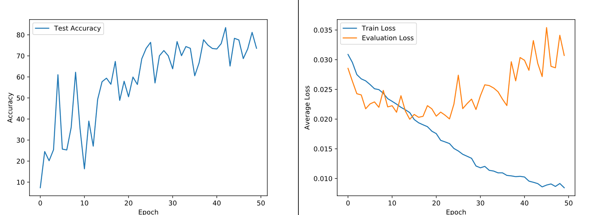

# Erkennung von Landmarks auf Satellitenbildern der Marsoberfläche
(Erarbeitet im Modul `KI in der Robotik` an der HTW Berlin, 2021)

## Inhalt

[Abbildungsverzeichniss 3](#_Toc83580856)

[1. Zielsetzung 1](#_Toc83580857)

[2. Die Daten 1](#_Toc83580858)

[2.1 Das Datenset 1](#_Toc83580859)

[2.2 Klassifizierung 1](#_Toc83580860)

[3. Auswirkung des Ungleichgewichts 2](#_Toc83580861)

[4. Umgang mit dem Datenset 4](#_Toc83580862)

[4.1 Class Weighting 4](#_Toc83580863)

[4.2 Oversampling - Weighted Sampler 5](#_Toc83580864)

[4.3 Undersampling 6](#_Toc83580865)

[4.3.1 231-Samples 6](#_Toc83580866)

[4.3.2 476-Samples 7](#_Toc83580867)

[5. Kombination der Methoden 8](#_Toc83580868)

[6. Verbesserungen des Neuronalen Netzes 9](#_Toc83580869)

[7. Fazit 11](#_Toc83580870)

[Anhang 13](#_Toc83580871)

[Klassen Beispielbilder 13](#_Toc83580872)

[Literatur und Quellen 14](#_Toc83580873)

## Abbildungsverzeichniss

[Figure 1 Darstelllung des Ungliechgewichts 2](./figures/figure_1.png)

[Figure 2: Loss im ersten Training 2](./figures/figure_2.png)

[Figure 3 Confusion Matrix 3](./figures/figure_3.png)

[Figure 4 Loss und Accuracy mit Class Weighting 5](./figures/figure_4.png)

[Figure 5: Accuracy und Loss mit dem Weighted Sampler 5](./figures/figure_5.png)

[Figure 6: Accuracy und Loss bei 231 Samples pro Klasse 7](./figures/figure_6.png)

[Figure 7 Confusion Matrix für 476 Samples 7](./figures/figure_7.png)

[Figure 8 Loss und Accuracy mit 476 Samples 7](./figures/figure_8.png)

[Figure 9 Grafische Darstellung der Samples pro Klasse 8](./figures/figure_9.png)

[Figure 10 Accuracy und Confusion Matrix für neues Datenset und neue Gewichte 9](./figures/figure_10.png)

[Figure 11 Figure 11 Accuracy und Loss auf Test- und Trainingsdaten 9](./figures/figure_11.png)

[Figure 12 Loss und Accuracy mit Random Transforms 10](./figures/figure_12.png)

[Figure 13 Loss und Accuracy mit dem vergrößerten Datenset 10](./figures/figure_13.png)

[Figure 14 Finale Confusion Matrix 11](./figures/figure_14.png)

# Zielsetzung

Ziel dieser Arbeit ist es verschiedene Klassen von Landmarke auf Satellitenbildern der Marsoberfläche zu erkennen und Klassifizieren.

Dies dient, vor allem, der Vertiefung er im Kurs und der Belegarbeit erlangten Erkenntnisse durch die Übertragung und Erweiterung dieser auf einen deutlich Komplizierteren Datensatz.

Der Datensatz bietet keine ausgewogene Verteilung von Samples pro Klasse, ist also stark Imbalanced.
Fokus dieser Arbeit wird es also seine verschiedenen Methoden zum Arbeiten mit Imbalanced Datasets zu Verwenden und die Auswirkungen dieser zu Untersuchen.

# Die Daten

## Das Datenset

Bei dem Datensatz handelt es sich um 73,031 Bilder der Marsoberfläche, welche aus insgesamt 180 Satellitenbildern des HiRISE Projekts extrahiert wurden.[[1]](#footnote-2) Beispiel Bilder Lassen sich im Anhang einsehen.

Genauer gesagt wurden 10,433 voneinander verschiedenen Landmarkes verwendet.
Dies wurden dann jeweils bearbeitet und vervielfältigt.

Jedes Originalbild wurde

* 90 Grad rotiert
* 180 Grad rotiert
* 270 Grad rotiert
* vertikal geflippt
* horizontal geflippt
* einer zufälligen Helligkeitsveränderung unterzogen

Daraus ergeben sich zu den originalen Bildern (6 \* 10,433) 62,598 weitere Bilder, welche zwar desselben Insgesamt kommt es dann zu den genannten (10,433 + 62,598) 73,031 Bildern.
Bei den Bildern handelt es sich um 227x227 große Bilder in Greyscale.

## Klassifizierung

Die Bilder lassen sich in 8 verschieden Klassen unterteilen (siehe Tabelle 1)

Die Klasse “other” Umfasst dabei nicht zuordbare Landmarks, welche nicht in eine der Anderen Klassen Fallen.

Das Datenset ist bereits mit Label Versehen, diese entsprechen denen in Tabelle 1 Aufgeführten.

| 0 | other |
| --- | --- |
| 1 | crater |
| 2 | dark dune |
| 3 | slope streak |
| 4 | bright dune |
| 5 | impact ejecta |
| 6 | swiss cheese |
| 7 | spider |

Die Zuordnung der Label zu den jeweiligen .jpg Dateien befand sich in einer .txt Datei.

Für Pytorch wandelte ich diese in eine .csv Datei um, in der sich in einer Spalte die Namen der Dateien und in der anderen das dazugehörige Label/Prediction Target befinden.

Table 1 Aufteilung der Klassen[[2]](#footnote-3)

Dabei stelle sich heraus das es zu den Verscheiden Klassen eine deutlich Abweichende Anzahl von Samples, also Bildern, gibt.

Die Anzahl an Samples pro Klasse ist in Tabelle 1 ersichtlich, zur Visualisierung der Imbalance wurde die Grafik 1 erstellt.

| Klasse | Anzahl der Samples |
| --- | --- |
| 0 | 61054 |
| 1 | 4900 |
| 2 | 1141 |
| 3 | 2331 |
| 4 | 1750 |
| 5 | 231 |
| 6 | 1148 |
| 7 | 476 |

Table 2 Anzahl an Samples je Klasse[[3]](#footnote-4)

Figure 1 Darstelllung des Ungliechgewichts

# Auswirkung des Ungleichgewichts

Für den ersten Trainingsversuch wurde ein Fully Connected Feed Forward Netz genutzt bestehend aus einem In- Output- und einem Hiddenlayer verwendet. Dies sollte vor allem zum Testen des Datensetz und der Label dienen und wurde auf 10 Epochen trainiert. Hierbei wurde ein Problem auffällig.

Es konnte beobachtet werden, dass das Model direkt von Beginn an auf eine Accuracy von 83.7% kam, sich von dort aber weder verbesserter noch verschlechterte.

Da von Anfang an die Vermutung bestand, dass der große Anteil von Samples der Klasse 0 für Probleme Sorgen würde, lies ich mir die Targets und Predictions ausgeben.

Figure 2: Loss im ersten Training

Diese sind im Folgen am Beispiel einer Batch zustehen.

**Predicted = 0, 0, 0, 0, 0, 0, 0, 0, 0, 0, 0, 0, 0, 0, 0, 0, 0, 0, 0, 0, 0, 0, 0, 0, 1, 0, 0, 0, 0, 0, 0, 0, 0, 0, 0, 0, 0, 0, 0, 0, 0, 0, 0, 0, 0, 0, 0, 0, 0, 0, 0, 0, 0, 0, 0, 0, 0, 0, 0, 0, 0, 0**

**Target = 0, 0, 0, 0, 0, 0, 4, 0, 2, 0, 0, 0, 0, 0, 0, 0, 0, 0, 0, 0, 0, 2, 0, 0, 0, 0, 0, 0, 0, 0, 0, 0, 0, 0, 0, 0, 1, 0, 2, 0, 0, 1, 0, 1, 3, 0, 0, 0, 0, 0, 6, 0, 0, 0, 0, 0, 0, 0, 3, 0, 0, 0, 5, 0**

Man kann erkenne, dass das Model immer die Klasse 0 (“other”) predicted, aber auch das im Target die Klasse „0“ einen sehr großen Anteil hat. Daraus ergibt sich eine relativ große Accuracy und ein kleines Loss (siehe Abbildung 2). Dies wird auch als Accurcay Paradox bezeichnet[[4]](#footnote-5) Auch wird dadurch verhindert, dass das Model lernt, denn die anderen Klassen kommen schlicht zu wenig vor.

Zur Behebung dieses Problem bzw. zum Arbeiten mit in dieser Weise ungleichen Datensets, gibt es reinige mögliche Vorgehensweisen[[5]](#footnote-6). Wobei zu berücksichtigen ist das eine Erhebung von weiteren Daten nicht möglich ist.

1. **Class** **Weighting**
   Für die Loss Funktion werden Gewichte für die einzelnen Klassen definiert. Diese beeinflussen, wie stark sich die jeweilige Klasse auf die Veränderung der Gewichte ausübt.
2. **Oversampling**Vervielfachung der Samples für Klassen mit einer geringen Anzahl an Samples.
   Bei der Vervielfachung können die Bilder bearbeitet werden, um einem Overfitting entgegenzuwirken.
3. **Undersampling**

Klassen mit vielen Samples werden verkleinert, d.h. ein Teil ihrer Samples wird ignoriert

Im folgenden Kapitel werden diese Methoden sukzessive ausprobiert und ausgewertet. Dabei werden Accuracy und das Loss im Training aufgezeichnet. Da die Accuracy in diesem Falle nicht zwangsläufig aussagekräftig über den Lernerfolg des Netzwerkes ist (Wie am Beispiel des ersten Trainingsdurchlaufes zu bemerken war). Werden, wenn nötig, andere Metriken wie eine Confusion Matrix zum Einsatz kommen.

Für das weitere Vorgehen habe ich das Neuronale Netzwerk um zwei Convolutional Layer, sowie zwei Max Polling Layer und einen weiteren Fully Connected Linear Layer erweitert.

Als Loss Funktion wird CrossEntropyLoss verwendet und als Optimizer kommt Adadelta zum Einsatz. Sämtliche Ergebnisse werden in einem separaten Git Branch festgehalten und können somit reproduziert werden.

Figure 3 Confusion Matrix

Eingehend wurde das neue Modell auf 50 Epochen trainiert. Die hohe Accuracy bleibt, durch die unveränderte Anzahl an Samples pro Klasse, bestehen viel zu große allerdings werden nun auch

Um die das Accuracy Paradox in zu bestätigen, wurde zusätzlich eine Confusion Matrix erstellt, diese hilft zu erkennen welche Klassen als welche Klassen erkannt werden. Sie stellt in einem solchen Fall eine zuverlässigere und genauere Metrik als Loss und Accuracy dar.

Die Confusion Matrix wurde am Ende des Trainings auf den Testdaten erstellt.
Sie stellt auf der Y-Ache die Targets und auf der X-Achse die Predictions dar. Entsprechend liegen alle korrekten Predictions auf der Haupdiagonale.

Die Confusion Matrix bestätigt die eingehende Vermutung, die meisten Klassen werden schlicht als 0 / others erkannt (siehe erste Spalte in Abbildung 4), dadurch werden auch die meisten Predictions als richtig gewertet (Siehe Erste Zeiler, Erste Spalte in Abbildung 4). An der Diagonalen der Matrix lässt sich aber auch erkennen das einige Klassen / Samples dieser korrekt erkannt werden (Hauptdiagonale).

(Reproduzierbar im Branch: reproduce\_initial\_test\_with\_newer\_model\_results)

# Umgang mit dem Datenset

## Class Weighting

| Klasse | Rechnung | Gewichtung |
| --- | --- | --- |
| 0 | 61054 / 61054 | 1 |
| 1 | 61054 / 4900 | 12,46 |
| 2 | 61054 / 1141 | 53,5 |
| 3 | 61054 / 2331 | 26,19 |
| 4 | 61054 / 1750 | 34,89 |
| 5 | 61054 / 231 | 264,3 |
| 6 | 61054 / 1148 | 53,18 |
| 7 | 61054 / 476 | 128,26 |

Die Gewichtung der einzelnen Klassen kann in Pytorch durch einen Tensor in der Loss Funktion geregelt werden, dieser enthält eine, der Menge der Klassen entsprechende, Anzahl von Multiplikatoren bzw. Gewichten. Ziel ist es durch diese den Einfluss auf das Lernen von den einzelnen Klassen auszugleichen

Table 3: Klassen und Gewichtungen

In diesem Fall sollen durch die Gewichtung der Klassen die Unterschiede in der Anzahl der Daten ausgeglichen werden. Dazu ergeben sich die Gewichte (siehe Tabelle 3).

Die Anwendung auf die Loss Funktion Erfolg wie folgt:

**torch.nn.CrossEntropyLoss(weight=torch.Tensor([1, 12.46, 53.5, 26.19, 34.89, 264.3, 53.18, 128.26]))**

Das Model wurde Über 50 Epochen trainiert. Erwartungsgemäß fällt die Accuracy weniger gut aus als bisher, da nichtmehr ausschließlich Nullen Predicted werden. In der Loss kurve lässt sich allerding erkennen das das Evaluation Loss (Testdaten) im Verlauf der 50 Epochen steigt, während es auf den Training Daten kontinuierlich sinkt (siehe Abbildung 5).

Daraus lässt sich Schlussfolgern, dass durch die niedrige Anzahl an Samplens in einigen Klassen und die auf diesen liegenden, höheren, Gewichten ein Overfitting stattfindet.

Figure 4 Loss und Accuracy mit Class Weighting

## Oversampling - Weighted Sampler

Für diese Methode benutze ich den torch.utils.data.WeightedRandomSampler mit den in Tabelle 3 beschriebenen Gewichten benutzt. Die Gewichte werden hier auf jedes Bild im Datensatz einzeln gesetzt (Je nach dessen Klasse).

Der WeightedSampler wird die Samples entsprechend ihrer Gewichtung (Wahrscheinlichkeit) öfter Sampeln und somit öfter vom Netz lernen lassen[[6]](#footnote-7). Mit anderen Worten, Bilder aus Klassen mit weniger verfügbaren Samples werden nun künstlich vervielfacht. Dies stellt eine einfache Möglichkeit des Oversamplings. Diese Methode hat den Vorteil, dass hier (im Gegensatz zu der vorher beschriebenen Methode) durch randomisierte Transformationen (Leichte Drehung des Bildes Beispielsweise) zusätzliche Samples generiert werden können.

Figure 5: Accuracy und Loss mit dem Weighted Sampler

**Predicted** = 0, 3, 0, 0, 0, 6, 1, 4, 1, 0, 0, 4, 4, 3, 0, 0

**Target** = 1, 5, 2, 0, 6, 6, 4, 3, 6, 7, 0, 4, 4, 0, 7, 3

An der Ausgabe von Target und Prediction kann man erkennen, dass nun vermehrt Samples anderer Klassen in die Batches kommen. Bei der Benutzung des WeightedSampler kommt es zu einem sehr Deutlichen Overfitting (siehe Abbildung 5) Es ist anzunehmen das die Ursache dafür darin liegt, dass für einige Klassen eine sehr geringe Anzahl and Daten vorhanden sind, welche nun immer wieder von dem Model gelernt werden, vergleichbar zu den mit dem Class Weighting erzählten Ergebnissen.

## Undersampling

Als dritter Weg um das Training zu ermöglichen bzw. zu verbessern, kommt eine weiter Methode infrage.

Dafür werden keine zusätzlichen Samples generiert um ein Gleichgewicht herzustellen, sondern Klassen mit vielen Daten, verkleinert, also Samples weggelassen.

Für Pytorch reicht es dabei die .csv Datei zu Bearbeiten in welcher ich die Labels und Pfade zu den Bildern speichere. Dazu wird hier Pandas benutzt, um die Daten aus der kompletten .csv Datei auszulesen, zu gruppieren und dann in unterschiedlicher Ausführung in eine neue .csv Datei zu schreiben. Dies geschieht im Skript image\_class\_sorter.py.

Um die Auswirkungen abzuschätzen habe ich zunächst drei verschiedenen Möglichkeiten untersucht.

1. **231 Samples pro Klasse**

Dafür habe ich mich an der Klasse 5 orientiert, welche die kleinste Anzahl an Samples aufweist (siehe Tabelle 2)

1. **476 Samples maximum pro Klasse**

dies Orientiert sich an der Zweitkleinsten klasse, die Klasse 5 bleibt dabei bei den gegebenen 231 Samples 4

1. **Komplettes Auslassen der Klasse 0**

die anderen Klassen bleiben wie gegeben (Tabelle 2). Damit ist das Dataset immer noch stark Imbalanced, und die Klasse 0 wird nicht gelernt. Dies stell also eine nicht optimale Lösung dar und wird hier nicht weiter behandelt.

### 231-Samples

(Die Ergebnisse können im Branch reproduce\_231\_samples)

Wie beschrieben wird hierfür eine .csv Datei mit 231 Sample pro Klasse erstellt. Auch mit diesem Datenset wurde auf 50 Epochen trainiert. Dabei konnte eine Accuracy von knapp 90 % erzielt werden (Siehe Abbildung 7).

Dennoch muss berücksichtigt werden das es sich hier um ein Stark vereinfachtes Datenset handelt,

weshalb es sich hierbei nur um einen Test der Auswirkungen des WeightedSampler handelt.

Figure 6: Accuracy und Loss bei 231 Samples pro Klasse

### 476-Samples

(Reproduzierbar in Branch: reproduce\_476\_samples\_results)

Ich führte einen weiteren Test, dieses Mal mit maximal 476 Samples pro Klasse Durch.
Es wurde wieder auf 50 Epochen trainiert.

Dieser Test verläuft ebenfalls vielversprechend und zeigt, mit den vorangegangenen Test, vergleichbare Ergebnissen (Siehe Abbildung 7). Die Confusion Matrix (Abbildung 9) zeigt aber dass es sich um korrekte Predictions handelt.

Figure 7 Loss und Accuracy mit 476 Samples

Figure 8 Confusion Matrix für 476 Samples

# Kombination der Methoden

(Reproduzierbar in Branch: reproduce\_mixed\_methods\_results)

In den Vorherigen Kapiteln wurde die Anwendung von Methoden zum Arbeiten Imbalance Datasets beschrieben und die Auswirkungen auf das Lernen in diesem spezifischen Fall getestet und gemessen.

Um darauf aufbauend weiterzuarbeiten, wird im im Folgenden versucht die beiden Methoden Oversampling und Undersampling miteinander zu verbinden, genauer gesagt wird versucht durch ein weiteres Datenset mit Beschränkten Samples pro Klasse das Undersampling umzusetzen, und von der anderen Seite, das immer noch bestehende Ungleichgewicht zwischen den Klassen durch Oversampling, mithilfe eines Weighted Sampler auszugleichen.

Für das Undersampling muss ein neues Datenset in Form einer neuen .csv Datei erstellt werden. Dieses Mal sollen mehr Samples pro Klasse vorhanden sein als in den Vorherigen Beispielen, um auf diese Weise mehr Unterschiede zwischen den Klassen erkennbar zu machen.

Es erscheint ein sinnvoller Ansatz dafür den Durchritt der Samples pro Klasse zu berechne und diesen als maximale Sampelanzahl zu verwenden. Die Klasse 0 soll in diesem Fall nicht berücksichtigt werden, da sie unverhältnismäßig groß ist und somit einen Durchschnitt ad absurdum führen würde. Auch die Klasse 5 wird wegen ihrer geringen Größe nicht berücksichtig.

Die maximale Anzahl an Samples ergibt sich also folgendermaßen:

= 2119,2 Samples pro Klasse

Es bleiben die Klasse 2, 5, 4, 5. 6 und sieben unter dieser Festgelegten Anzahl.
Der durch Oversampling auszugleichende Unterschied ist in diesem Fall jedoch deutlich niedriger (Siehe Abbildung 9 und 1)

| **Klasse** | **Anzahl Samples** | **Gewichtung** |
| --- | --- | --- |
| 0 | 2119 | 1 |
| 1 | 2119 | 1 |
| 2 | 1141 | 1.85 |
| 3 | 2119 | 1 |
| 4 | 1750 | 1.21 |
| 5 | 231 | 12.95 |
| 6 | 1148 | 1.85 |
| 7 | 476 | 4.45 |

Table 4 Klassen und Gewichtung

Figure 9 Grafische Darstellung der Samples pro Klasse

Das Training über 50 Epochen auf diesem Datensatz führte zu einer Accuracy von circa 60%. Auch ein Längeres Training konnte diese nicht Steigern. Die Confusion Matrix / dieses versucht zeig aber, dass die Klassen weitersagend richtig Predicted werden. Das Problem mit dem Ungleichgewicht scheint weitestgehend behoben zu sein, ohne dabei auf zu viele Daten verzichten zu müssen. Weitere Verbesserungen der Predictions sollen von daher am Neuronalen netz selbst stattfinden.

Figure 10 Accuracy und Confusion Matrix für neues Datenset und neue Gewichte

# Verbesserungen des Neuronalen Netzes

An dieser Stelle wird das weitere Vorgehen und die damit erzielten Verbesserungen erläutert.
Es werden dabei nicht alle Schritte und Statistiken genannt und gezeigt. Diese lassen sich in ihrer Gänze im Branch model\_improvements einsehen.

Figure 11 Figure 11 Accuracy und Loss auf Test- und Trainingsdaten

Um dieses zu verkleinern, versuchte ich zunächst die Convolution Layer, also die Kernel Size, und Pooling Layer anzupassen, um zu verhindern das zu viele Details gelernt werden. Dieses Brachte nur kleinere Verbesserungen.

Durch das anschließende Anwenden von Randomisierten Transformationen auf den einzelnen Samples und das Normalisieren des Daten Satzes (welches bis zu diesem Punk außen vorgelassen wurde) konnte das Overfitting wesentlich verbessert werden.

Figure 12 Loss und Accuracy mit Random Transforms

| **Klasse** | **Anzahl Samples** | **Gewichtung** |
| --- | --- | --- |
| 0 | 4238 | 1 |
| 1 | 4238 | 1 |
| 2 | 1141 | 13.71 |
| 3 | 2119 | 1.82 |
| 4 | 1750 | 2.42 |
| 5 | 231 | 18.35 |
| 6 | 1148 | 3.69 |
| 7 | 476 | 5.68 |

An diesem Punkt wurde die im vorangegangenen Kapitel
definierte Sample Anzahl verdoppelt und die Gewichte entsprechend angepasst.

Schlussendlich brachte das Weglassen eines der Linear Layer und die nach hinten gehender Verkleinerung der Outputs der übrigen drei Layer eine Verbesserung.

Somit konnte das Model über 100 Epochen auf eine Accuracy
von bis zu 74.8% trainiert werden.

Table 5 Samples und Gewichte

Die entsprechende Confusion Matrix lässt auch erkennen das nun alle Klassen zumeist korrekt erkannt werden.

Figure 13 Loss und Accuracy mit dem vergrößerten Datenset

Figure 14 Finale Confusion Matrix

# Fazit

Das Eingangs beschriebene Datenset war, in seiner Ursprünglichen Unausgeglichenen Form, nicht zum Training geeignet. Im Verlauf dieser Arbeit wurden mehrere Methoden zum Ausgleichen dieses Ungleichgewichtes beschrieben, getestet und ausgewertet.

Oversampling mithilfe des Weighted Samplers sowie Undersampling, durch das entsprechende Verkleinern des Datensets brachten dabei gute Ergebnisse. Die Gewichtung einzelner Klassen in der Loss Funktion war in diesem Fall nicht zielführend.

Schlussendlich funktionierte eine Kombination von Over- und Undersampling. Diese ermöglichte es Möglichst viele der Daten und die darin enthaltenen Informationen beibehalten zu können.

Trotzdem kommt es beim Training auf diesem Datenset zu Problemen.
Als Ursache dafür wird die immer noch bestehende Wiederholung von Samples aus Klassen mit einer geringen Sampleanzahl und ein damit einhergehendes Overfitting vermutet.

Diesem kann durch mehrere, hier nicht angewendete Methoden entgegengewirkt werden.

* **Weitere, künstliche, Samples.**
  Durch das leichte Bearbeiten von bestehenden Samples, können mehr Samples generiert werden. Dies sollte das Auswendiglernen von Details vermeiden.
* **Anpassung der Convolution und der Pooling Layer.**

Dadurch sollte ein besseres Filtern von Details ermöglicht werden, wären entscheidende Muster beibehalten und gelernt werden können.[[7]](#footnote-8) [[8]](#footnote-9)

* **N-Cross-Validation**

Die Daten werden in „N“ Blöcke bzw, „Folds“ aufgeteilt. Gelernt wird auf N-1 dieser Folds.

Der übriggebliebene Datenblock wird als Test verwendet. Das Ganze wird N mal Rotiert, jedes Mal mit einem anderen Block als Test Daten.[[9]](#footnote-10)

Diese Technik wurde bei meiner Suche nach Lösungen des Öfteren genannt und findet deshalb auch hier eine Erwähnung.

Aus gründen von Umfang und Zeitaufwand konnten diese Methoden im Rahmen dieser Arbeit nicht (vollständig) angewandt bzw. getestet werden.

Abschließend bleibt zu sagen, dass wie an Abbildung 14 zu erkennen ist, ein Training auf dem gegebenen Datenset ermöglicht wurde.

# Anhang

## Klassen Beispielbilder

| Klasse 0 | Klasse 1 | Ein Bild, das Unschärfe enthält.  Automatisch generierte BeschreibungKlasse 2 |
| --- | --- | --- |
| Klasse 3 | Klasse 4 | Klasse 5 |
| Klasse 6 | Klasse 7 |  |

# Literatur und Quellen

‘Accuracy Paradox’, *Data Science & Deep Learning*, 2015 <https://deepdatascience.wordpress.com/2015/04/15/hello-world/> [accessed 24 September 2021]

‘Convolutional Neural Network 3: Convnets and Overfitting » AI Geek Programmer’, *AI Geek Programmer*, 2020 <https://aigeekprogrammer.com/convnets-and-overfitting/> [accessed 26 September 2021]

Doran, Gary, Steven Lu, Lukas Mandrake, and Kiri Wagstaff, ‘Mars Orbital Image (HiRISE) Labeled Data Set Version 3’ (Zenodo, 2019) <https://doi.org/10.5281/ZENODO.2538136>

‘Torch.Utils.Data — PyTorch 1.9.1 Documentation’ <https://pytorch.org/docs/stable/data.html?highlight=weightedrandomsampler#torch.utils.data.WeightedRandomSampler> [accessed 24 September 2021]

Valdarrama, Santiago, ‘How to Deal with an Imbalanced Dataset in Machine Learning’, *Medium*, 2021 <https://towardsdatascience.com/how-to-deal-with-an-imbalanced-dataset-in-machine-learning-4f89a1967868> [accessed 24 September 2021]

‘Was ist Cross-Validation? Leicht erklärt | DataMines’ <https://datamines.de/cross-validation/> [accessed 26 September 2021]

1. Gary Doran and others, ‘Mars Orbital Image (HiRISE) Labeled Data Set Version 3’ (Zenodo, 2019) <https://doi.org/10.5281/ZENODO.2538136>. [↑](#footnote-ref-2)
2. Doran and others. [↑](#footnote-ref-3)
3. Doran and others. [↑](#footnote-ref-4)
4. ‘Accuracy Paradox’, *Data Science & Deep Learning*, 2015 <https://deepdatascience.wordpress.com/2015/04/15/hello-world/> [accessed 24 September 2021]. [↑](#footnote-ref-5)
5. Santiago Valdarrama, ‘How to Deal with an Imbalanced Dataset in Machine Learning’, *Medium*, 2021 <https://towardsdatascience.com/how-to-deal-with-an-imbalanced-dataset-in-machine-learning-4f89a1967868> [accessed 24 September 2021]. [↑](#footnote-ref-6)
6. ‘Torch.Utils.Data — PyTorch 1.9.1 Documentation’ <https://pytorch.org/docs/stable/data.html?highlight=weightedrandomsampler#torch.utils.data.WeightedRandomSampler> [accessed 24 September 2021]. [↑](#footnote-ref-7)
7. ‘Convolutional Neural Network 3: Convnets and Overfitting » AI Geek Programmer’, *AI Geek Programmer*, 2020 <https://aigeekprogrammer.com/convnets-and-overfitting/> [accessed 26 September 2021]. [↑](#footnote-ref-8)
8. ‘Convolutional Neural Network 3’. [↑](#footnote-ref-9)
9. ‘Was ist Cross-Validation? Leicht erklärt | DataMines’ <https://datamines.de/cross-validation/> [accessed 26 September 2021]. [↑](#footnote-ref-10)
